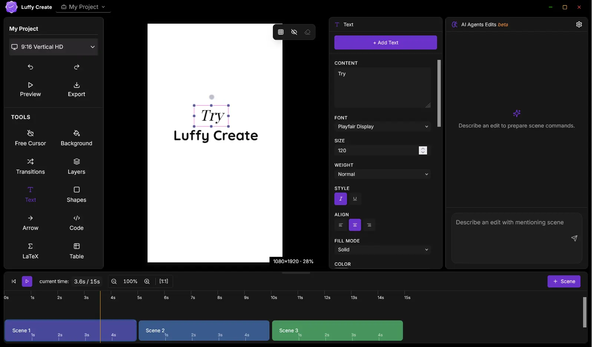

<div align="center">


# Luffy Create

**Luffy Create** is a **_free_** and **_open source_** AI _video editing, video creation, image editing_ and _graphic designing_ web **app**.

[](https://github.com/Creatorsai-Lab/luffy-create/releases/latest)
[](LICENSE)
[](https://github.com/Creatorsai-Lab/luffy-create/releases/latest)


<table style="width: 100%; border-collapse: collapse; border: 1px solid #cccccc;">
    <tr>
      <td style="border: 1px solid #cccccc; padding: 12px; text-align: center;">
        <a href="https://creatorsai-lab.github.io/luffy-create/" style="text-decoration: none;">🌏︎ Website</a>
      </td>
      <td style="border: 1px solid #cccccc; padding: 12px; text-align: center;">
        <a href="https://github.com/Creatorsai-Lab/luffy-create/releases/latest" style="text-decoration: none;">[↧] Download</a>
      </td>
      <td style="border: 1px solid #cccccc; padding: 12px; text-align: center;">
        <a href="https://creatorsai-lab.github.io/luffy-create/blog/luff-create-best-free-ai-video-editor.html"style="text-decoration: none;">✉ Blogs </a>
      </td>
      <td style="border: 1px solid #cccccc; padding: 12px; text-align: center;">
        <a href="https://github.com/Creatorsai-Lab/luffy-create/tree/main/docs#readme" style="text-decoration: none;">🗐 User Guide</a>
      </td>
    </tr>
</table>
</div>

Luffy Create has been built with the principle of providing a lightweight and fast editing experience. **Goal:** Our aim is to make 'Luffy Create' the best editing app for **_animations, transitions, and effects_**.


## Features

- **Precise timeline editor** with scene blocks, media timing, audio lanes, markers, playback preview, and transition control
- **AI Edits** — structured assistant commands for adding scenes, text, media, animation, backgrounds, and timeline audio
- **Automatic captions** with editable cue timing and subtitle styling controls
- **Rich elements** — text, gradients, shapes, arrows, hand drawing, syntax-highlighted code blocks, images, videos, audio, charts, tables, icons, counters, and LaTeX
- **Python Sandbox** for charts, generated visuals, and Manim math animations that can be inserted into the editor
- **Animations and transitions** — enter / loop / exit effects, text bounce, typewriter, draw-path, flow, move, scale, fade, zoom, and morph
- **Image & video styling** — color adjustments, crop, blur, shadows, gradient borders, animated borders, background images, and perspective transforms
- **Export** — MP4 video and PNG / WebP stills, rendered locally with FFmpeg
- **Offline-first** — everything runs on your machine; no sign-up, no cloud, no telemetry

---

<div align="center">



<sub>The Luffy Create editor: tools on the left, canvas in the center, properties on the right, AI edits at the side, and timeline below.</sub>

</div>

---

## Download & Install

You can download the app from `release` page or `site`

### Windows

1. Download the latest `Luffy-Create-Windows-Setup-*.exe` from the [**Releases page**](https://github.com/Creatorsai-Lab/luffy-create/releases/latest).
2. Run the installer. Windows SmartScreen may show an *"Unknown publisher"* warning — click **More info → Run anyway**. The app is unsigned for now and completely safe (source is public, build it yourself if you prefer).
3. Launch **Luffy Create** from the Start Menu.

### macOS

1. Download the latest `.dmg` from the [**Releases page**](https://github.com/Creatorsai-Lab/luffy-create/releases/latest).
2. Open it and drag **Luffy Create** into Applications.
3. First launch: right-click the app → **Open** (the build is unsigned, so Gatekeeper requires this once).

### Linux

1. Download the latest `.AppImage` from the [**Releases page**](https://github.com/Creatorsai-Lab/luffy-create/releases/latest).
2. Make it executable: `chmod +x Luffy*.AppImage`
3. Run it: `./Luffy*.AppImage`

---

## Quick Start

1. **New project** → pick a canvas size (16:9, 9:16, square, etc.)
2. **Add a background** from the Background tool
3. **Add elements** — text, shapes, code, images, video from the left sidebar
4. **Animate** — select an element and add an enter / loop / exit animation
5. **Preview** with the timeline play button
6. **Export** → choose MP4 or an image format → Save

Full walkthrough in the [**User Guide**](docs/README.md).

---

## Build from Source

Requires [Node.js](https://nodejs.org) 18+ and npm.

```bash
# Clone
git clone https://github.com/Creatorsai-Lab/luffy-create.git
cd luffy-create

# Install dependencies
npm install

# Run in development
npm run dev

# Build a production installer (output in dist/)
npm run package
```

The packaged installer for your current OS lands in `dist/`.

---

## Tech Stack

| Layer | Technology |
|---|---|
| Shell | [Electron](https://www.electronjs.org/) |
| UI | [React](https://react.dev/) + [TypeScript](https://www.typescriptlang.org/) |
| Canvas | [Konva](https://konvajs.org/) / react-konva |
| State | [Zustand](https://github.com/pmndrs/zustand) + [Immer](https://immerjs.github.io/immer/) |
| Styling | [Tailwind CSS](https://tailwindcss.com/) |
| Build | [electron-vite](https://electron-vite.org/) + [electron-builder](https://www.electron.build/) |
| Video export | [FFmpeg (WASM)](https://ffmpegwasm.netlify.app/) |
| Code editor | [Monaco](https://microsoft.github.io/monaco-editor/) |

---

## Documentation

| Guide | Covers |
|---|---|
| [Overview](docs/editor.md) | Interface tour, projects, scenes, quick start |
| [Elements](docs/elements.md) | Every element type and its properties |
| [Animations](docs/animations.md) | Timing, easing, all animation types |
| [Adjustments](docs/adjustments.md) | Filters, crop, perspective warp |
| [Audio](docs/audio.md) | Voiceover, music, fades, effects, markers, and timing |
| [Video](docs/video.md) | Video upload, trim, crop, styling, timing, and motion |
| [AI Agent](docs/ai_agent.md) | Safer AI edit requests and structured command plans |
| [Python Sandbox](docs/python_sandbox.md) | Charts, generated assets, and Manim animation outputs |
| [Export](docs/export.md) | MP4 / PNG / WebP export workflow |
| [Shortcuts](docs/shortcuts.md) | Keyboard reference |

---

## Contributing

Issues and pull requests are welcome. For bugs, please include your OS, steps to reproduce, and screenshots if relevant.

---

## License

Released under the [MIT License](LICENSE).
